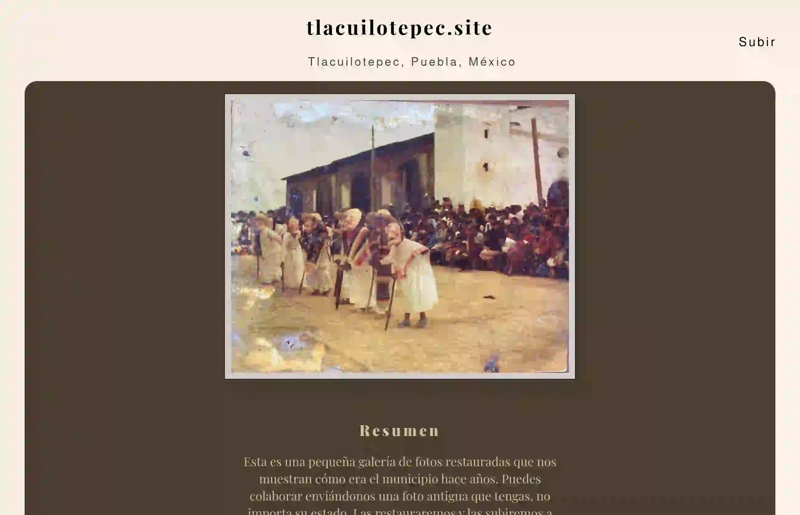

## 🖼️ Galería de Fotos Históricas

## Descripción

**Galería de fotos simple con un poco de JavaScript.**  
Esta web fue creada para compartir imágenes antiguas de un municipio, restauradas y mejoradas usando herramientas como **GIMP** y **Photoshop**. Es una forma de preservar y mostrar la historia local de manera visual y accesible.

---
##  Características

- Visualización de fotos restauradas en alta calidad.
- Interfaz simple, ligera y compatible con dispositivos móviles.
- Funcionalidad para **descargar** las imágenes directamente.
---
##  Tecnologías Usadas
- **HTML + CSS**: Estructura y estilos de la página.
- **JavaScript**: Animaciones, interactividad básica y descargas.
- **GIMP / Photoshop**: Restauración y mejora de imágenes.
---
##  Licencia y Uso
- Esta plantilla es completamente **libre para copiar, modificar y mejorar**.  
- Ideal para proyectos culturales, archivos históricos o cualquier persona interesada en crear una galería sencilla pero significativa.
---
##  Créditos

Hecho con cariño para revivir y compartir la historia local.  
¿Ideas o mejoras? ¡Los pull requests son bienvenidos!